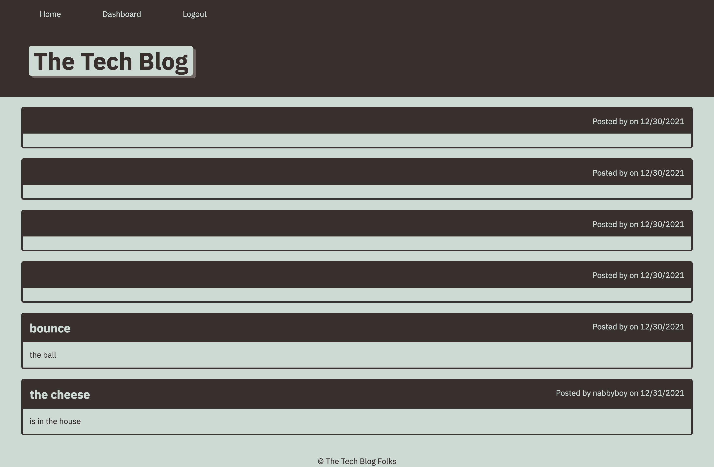
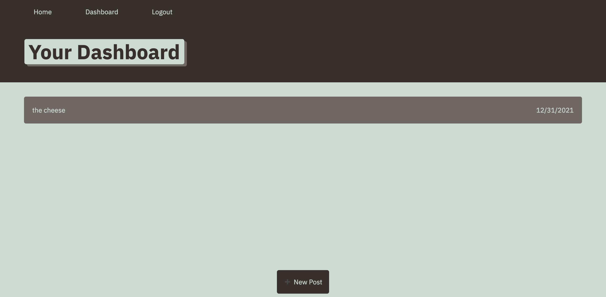
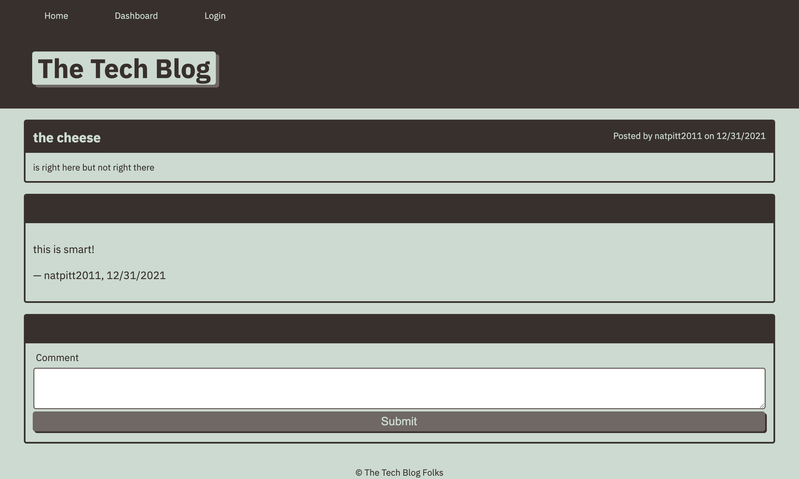

# Tech-Blog
  
  
  ## Description 
  The goal of this project is to allow the client to post about technology on this blog. The user must authenticate themselves by signing up (or if they are already signed up, by logging in) so that the user can create, update and delete posts and then read others and comment on them. 

  ## Table of Contents
  * [Installation](#installation)
  * [Usage](#usage)
  * [Contributing](#contributing)
  * [License](#license)
  * [Questions](#questions)
  * [Media](#media)

  
  ## Installation 
  The user must first install node. After that the user will need to install express.  Express will allow us to connect to the server. Other programs needed to run this program are bcrypt (encryption of passwords and comparing those passwords), connect-session-sequelize, dotenv (to store sensitive material like passwords), express-handlebars, express-session.mysql2, and sequelize.
  ## Usage 
  You will need to run npm init -y and npm i express as well as npm i for the other npms listed above. 
  ## License 
  This project is license under MIT License
 

  ## Questions
  If you have any questions about this projects, please contact me directly at nathaniel.epstein@gmail.com. You can view more of my projects at https://github.com/natpitt2393.

  ## Media
  
  
  
  